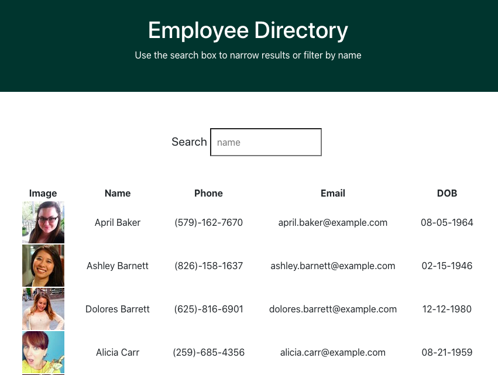

# employee-directory

## Description

Using React, I created an employee directory for quick access to  information, including:

* Image
* Name
* Phone Number
* Email
* Date of Birth (DOB)

Users can search a particular name or sort the names either in ascending or descending order.

An employee or manager would benefit greatly from being able to view non-sensitive data about other employees.

## API Used:
randomuser.me

## Technologies
Created application using create-react-app

## Links

[Application](https://katnguyenn.github.io/employee-directory/)

[LinkedIn](https://www.linkedin.com/in/katherine-nguyen-205a7b13a/)